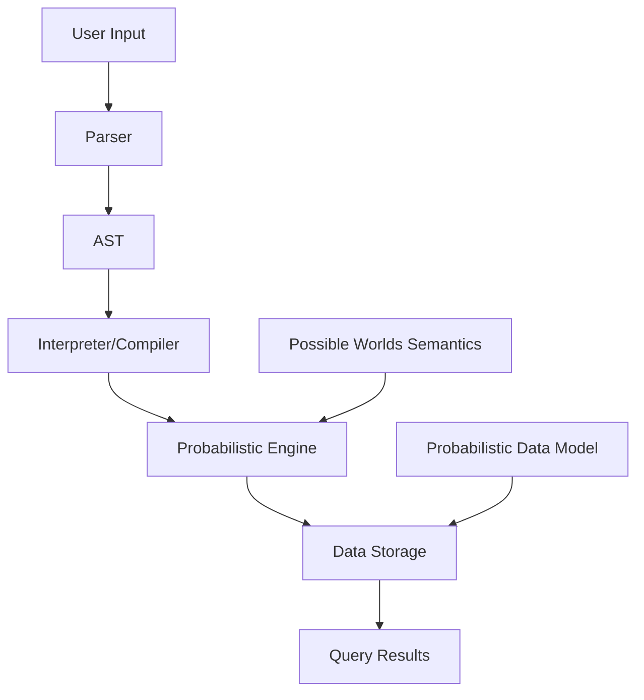

# BloomDB AI-Integrated IDE Development Plan

## Overview
BloomDB is now designed as an AI-integrated Integrated Development Environment (IDE) specifically for probabilistic database development and AI-assisted probabilistic programming. This IDE will address serious pain points in ML/AI/data science by providing intelligent tools for handling uncertainty, probabilistic modeling, and scalable computations.

## What is an AI-Integrated IDE?
An AI-integrated IDE combines traditional development environment features (code editing, debugging, project management) with artificial intelligence capabilities:
- **Intelligent Code Completion**: Context-aware suggestions for probabilistic operations
- **Automated Probabilistic Modeling**: AI-assisted generation of probabilistic queries and models
- **Uncertainty Analysis Tools**: Built-in visualization and analysis of probabilistic data
- **AI-Powered Debugging**: Intelligent error detection and correction for probabilistic code
- **Integration with ML Frameworks**: Seamless connection to popular AI/ML libraries

### BloomDB IDE's Unique Focus
- Specialized for probabilistic databases and programming
- AI assistance tailored to uncertainty handling and probabilistic reasoning
- Tools for scalable probabilistic computations and inference
- Integration with existing database systems for probabilistic extensions

## Existing Serious Pain Points in ML/AI/Data Science Markets

### 1. Scalability of Probabilistic Computations
- **Problem**: Possible worlds semantics leads to exponential complexity; existing systems like MayBMS struggle with large datasets
- **Solution**: BloomDB's efficient representation and query optimization for probabilistic data

### 2. Uncertainty Quantification in ML Models
- **Problem**: ML models produce point estimates, but real-world applications need confidence intervals and uncertainty measures
- **Solution**: Native probabilistic operators for model uncertainty, Bayesian inference support

### 3. Data Quality and Missing Values
- **Problem**: Sensor data, IoT streams, and real-time data often have missing or uncertain values; traditional imputation methods are inadequate
- **Solution**: Probabilistic data model with built-in handling of incomplete information

### 4. Integration with Existing Database Systems
- **Problem**: No commercial probabilistic databases; hard to integrate probabilistic features into SQL-based systems
- **Solution**: BloomDB as a query language that can extend or interface with existing databases

### 5. Probabilistic Inference on Big Data
- **Problem**: Performing Bayesian inference or probabilistic reasoning on large-scale data is computationally expensive
- **Solution**: Optimized execution engine for probabilistic operations and aggregations

### 6. Explainability and Interpretability
- **Problem**: Probabilistic models are often "black boxes"; need ways to explain uncertainty in predictions
- **Solution**: Query capabilities to explore and visualize probabilistic relationships

## Architecture Overview

## Development Phases

1. **Research & Design** (Current)
2. **Core Implementation**
3. **Query Engine**
4. **Programming Extensions**
5. **Optimization & Testing**

## Key Features
- Probabilistic data types (tuples with confidence)
- Query operators: SELECT with PROBABILITY, EXPECTED, etc.
- Programming constructs: probabilistic variables, sampling functions
- Integration with ML frameworks